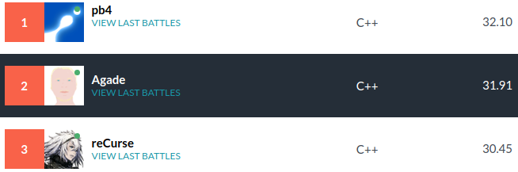

# Agade Fall 2020 Challenge Postmortem

I will describe my AI which finished 2nd in the Fall 2020 Codingame Challenge.



## Introduction

As eulerscheZahl alluded to on the forums, there are a lot of beam search post mortems. This might be the ultimate "I coded a beam search" postmortem. 

I extensively used my [local arena](https://github.com/Agade09/Fall2020-Challenge-Arena) to test modifications.

## Beam Search

Beam search in combination with a good evaluation was very good at finding close to optimal solutions in this challenge. I found locally that giving myself more search time and beam width did not improve playing strength. Therefore, my attempts to code a Beam Stack Search were a waste of time, albeit an interesting one. Similarly, I had this idea in mind that beam search may be blind to certain good moves because they start off too poorly. I thought that doing one beam for each action, a kind of NBeam Search might be better. This was also a waste of time proved by the fact that locally searching double the width for double the time achieved nothing.

### Approximate Beam Search pseudocode
```
Prev_Depth, Curr_Depth = vector<node>{};
Prev_Depth.push_back(node{Curr_State});
array<pair<double,action>,Max_Depth> Best_Move;
fill(Best_Move.begin(),Best_Move.end(),make_pair(action{REST},-numeric_limits<double>::max()));
int curr_depth{0};
while(true){
  ++curr_depth;
  for(node &a:Prev_Depth){
    for(action &mv:Possible_Actions(a.state){
      //Check for time and break out of search if done
      node b=a;
      Simulate(b.state,array<action,2>{mv,action{REST}}); //Opponent rests
      b.score=Eval(b.state);
      b.first_action=curr_depth==1?mv:a.first_action;
      if(Best_Move[curr_depth].first>b.score){
        Best_Move[curr_depth].first=b.score;
        Best_Move[curr_depth].second=b.first_action;
      }
      Curr_Depth.push_back(b);
    }
  }
  //Depth done
  nth_element(Curr_Depth.begin(),next(Curr_Depth.begin(),Beam_Width),Curr_Depth.end(),[](node &a,node &b){return a.score>b.score;});
  Curr_Depth.erase(next(Curr_Depth.begin(),Beam_Width),Curr_Depth.end());
  swap(Curr_Depth,Prev_Depth);
}
...
//Play best move of last finished depth
```
If what is believed to be a winning sequence of moves is found after finishing a depth, I play that depth's best move. I thought maybe sometimes it may be better to prolongate the game a bit for a higher score, but did not manage to evaluate this in a way that increased playing strength.

The game had timeout issues which required dealing with rare cases where there wasn't even time for depth 1, returning a bad move rather than timing out. This was important because my last version had 4% timeouts in the arena.
### Avoiding transpositions
I used a Zobrist type hash on inventory contents, player scores, recipes done, spells castable, spells owned and current turn. Then, in a hash table I keep track of which states have already been seen. It is a ```unordered_map<Hash_Type,vector<node>::iterator>```, I keep track of which nodes have been added into ```Curr_Depth``` and where they are in this vector. If a transposition is found, it is either discarded or replaces the current node with an inferior score in ```Curr_Depth```.

### Eval
The eval of a game state is given by:
- If game over
  - ```20k + My_Final_Score``` if won
  - ```-20k + My_Final_Score``` if loss
  - ```My_Final_Score``` if draw
- Else
  - ```My_score```
  - ```0.8(1 Tier0 + 2 Tier1 + 3 Tier2 + 4 Tier3)```
  - ```0.8(1.25 Repeatable_Spells+ 1 Non_Repeatable_Spells)```
    - Up to 11 spells, with priority to repeatable ones
  - ```0.2(1.25 Repeatable_Spells+ 1 Non_Repeatable_Spells)```
    - Past 11 spells

The eval of a sequence of moves is the discounted sum of changes in evaluation. Discounted by a factor of ```0.98```.

With this evaluation I often saw my AI casting too early, not buying spells fast enough to my taste. CASTing can wait, the opponent cannot interfere with your casts, but he can interfere with your LEARNs and BREWs. So I took the ingredient score out of the discounting. In practice it is ```0.1``` times in the discounted part of the score of the sequence of moves and ```0.9``` times in the undiscounted part. An amputation test of this feature in my last version values this change at ~10% winrate in self-play. The small amount of discounting is to tie-break sequences of actions which would perhaps REST before CASTing.

## Opponent modelling

What shot me up to rank 1 around saturday was trying again a feature from around Tuesday. Run a fast beam search for the opponent and then do your beam search assuming he will follow the sequence of actions found, padded with REST. Programming wise, the hash map can be used to store "discoverer" information to reconstruct the sequence of actions which lead to the best final state.

- Enemy beam searches up to depth 15, beam width 150 and 10ms computation time. 
  - I REST
- I beam search with uncapped depth, beam width 350 and 30ms computation time. 
  - Opponent plays sequence of actions found
    - Padded with REST
    - Invalid actions become REST

I had found in self-play that searching past depth 15 was approximately useless. Hence the limit on the opponent's depth.

Locally, in self-play, amputating this opponent modelling causes a loss of ~30% in winrate. I used [CGBench](https://github.com/s-vivien/CGBenchmark) to double check the value of this specific feature because self-play evaluation is risky when it comes to opponent prediction. Against other players the impact was not as dramatic but it was there, very roughly ~15% seen with CGBench.

## An interesting idea which didn't work

I thought this contest was close to Smash The Code, in that there would be many paths to a decent score. In STC running the same AI twice would always find different combos with a similar score. I figured playing the move which lead to the most good combos would be safer to the opponent's interference with BREWs and LEARNs. Thus I tried, instead of playing the action leading to the highest score, playing the action starting most of the top N (e.g. 10) sequences of actions found by the beam search. This never showed promise. And I think my original intuition of comparing this game to smash the code was simply wrong. There doesn't seem to be so many good paths. Maybe because there are 5 potions, whereas STC had an exponential number of ways of constructing combos.

# Conclusion
I finished with about 600 lines of C++ (excluding testing methods). I did not use bitsets and my performance never exceeded 80k simulations per turn measured in the beam search. I am not exceedingly happy with my evaluation of spells, I did not manage to do anything fancy there. After the contest, I took [pb4's](https://github.com/pb4git/Fall-Challenge-2020) single spell value coefficients (ignoring his combo values for now) and quickly found a ~3% winrate improvement in self-play.

I had no intention of participating in the contest and started a day late on Friday. pb4 suggested I participate, the game looked cool and I was lacking motivation these days so I thought it would be good for me to take a trip down "nostalgia lane" and tryhard this contest. I was really rusty after not competing for two and a half years; this 2nd place means a lot to me.
